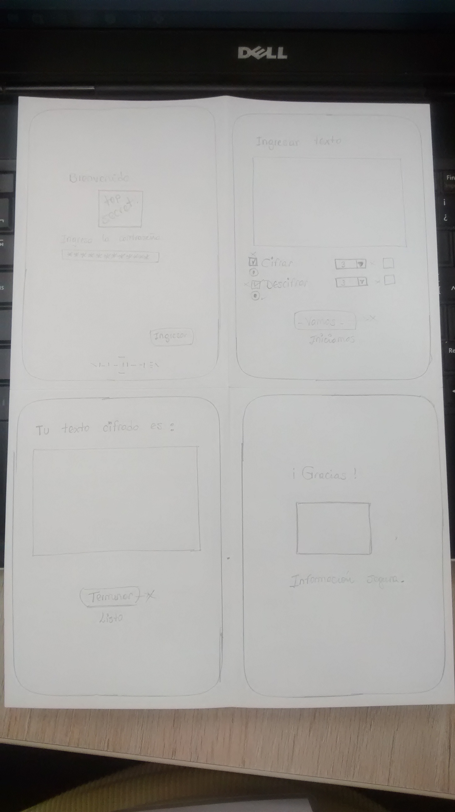

# CONFIDENCIAL 
## Breve descripción del Programa 
El progrma permite obtener la declaracion de un testigo protegido y su Abogado, permitiendo asi que el juicio continue y mantener la condicion del testigo.

## Imagen final del Proyecto "*CONFIDENCIAL*"
![final1.png][final1.png]  ![final2.png][final2.png] ![final3.png][final3.png]  ![final4.png][final4.png]

 [1]: imagenes/final1.png
 [2]: imagenes/final2.png
 [3]: imagenes/final3.png
 [4]: imagenes/final4.png 

## Investigacion UX:
- Los usuarios del programa *CONFIDENCIAL* son Abogados y testigos protegidos

- Para este caso en particular los testigos protegidos por su misma condición, no se exponen y este programa hará que la comunicación sea directa y la declaración llegue a buenas manos
## Prototipo en papel:

##  Feedback recibido indicando las mejoras a realizar
- Mi prototipo no tenía el boton de Ingresar en la primera pagina, asi que para el prototipo en balsamiq, lo considere.

- En la página donde se realizará el cifrado y descifrado la elección del proceso la cambie a checkbutton y la cajita desplegable para elegir el offset, como sera parte de la clave que se compartirá entre Abogado y testigo es una caja de texto en la que ingresará el número indicado.

## Imagen del prototipo final en Balsamiq
![1][1]  ![Imagen 2][2] ![Imagen 3 ][3]  ![Imagen 4][4]

 [1]: imagenes/1.png
 [2]: imagenes/2.png
 [3]: imagenes/3.png
 [4]: imagenes/4.png 

